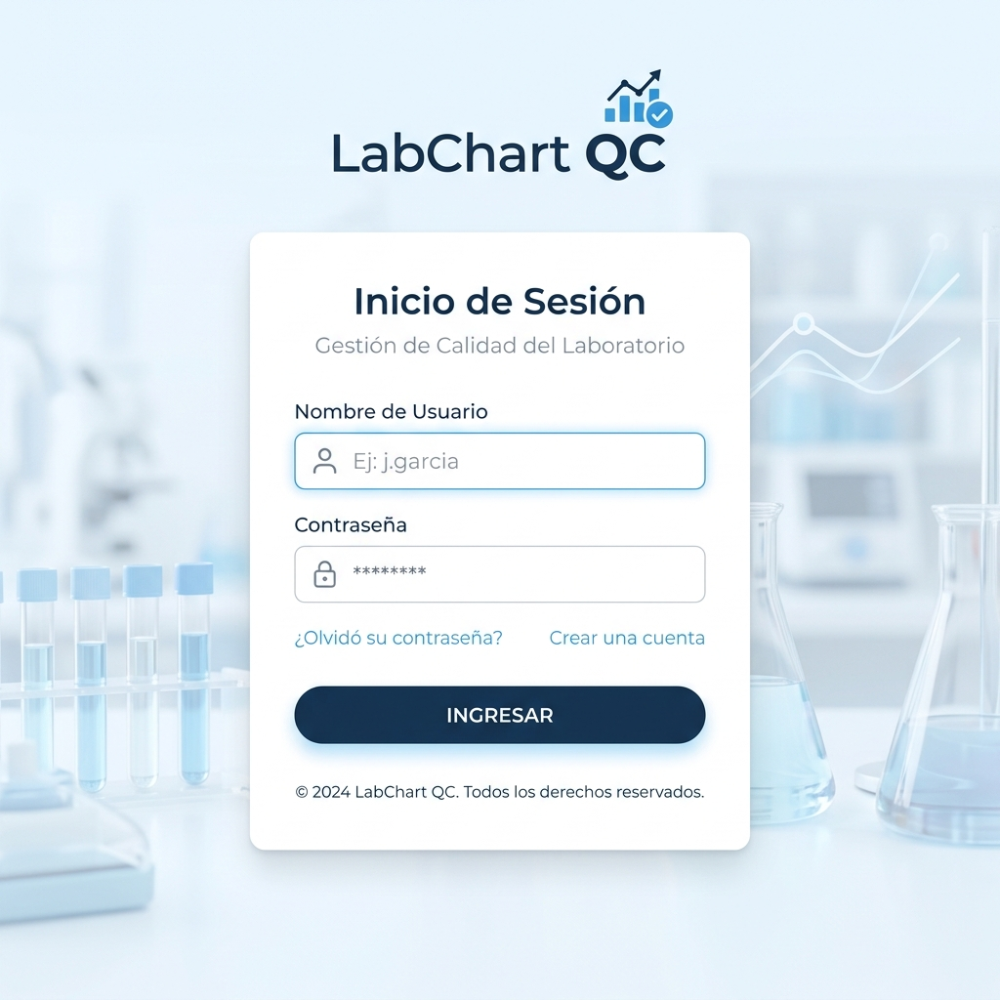
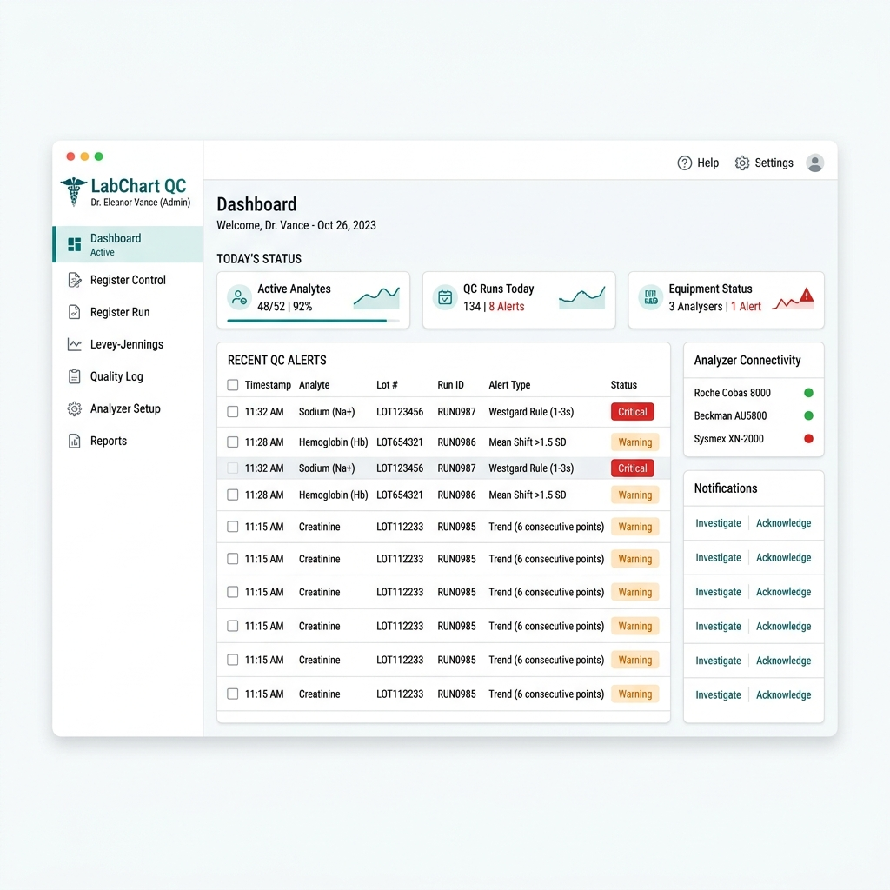
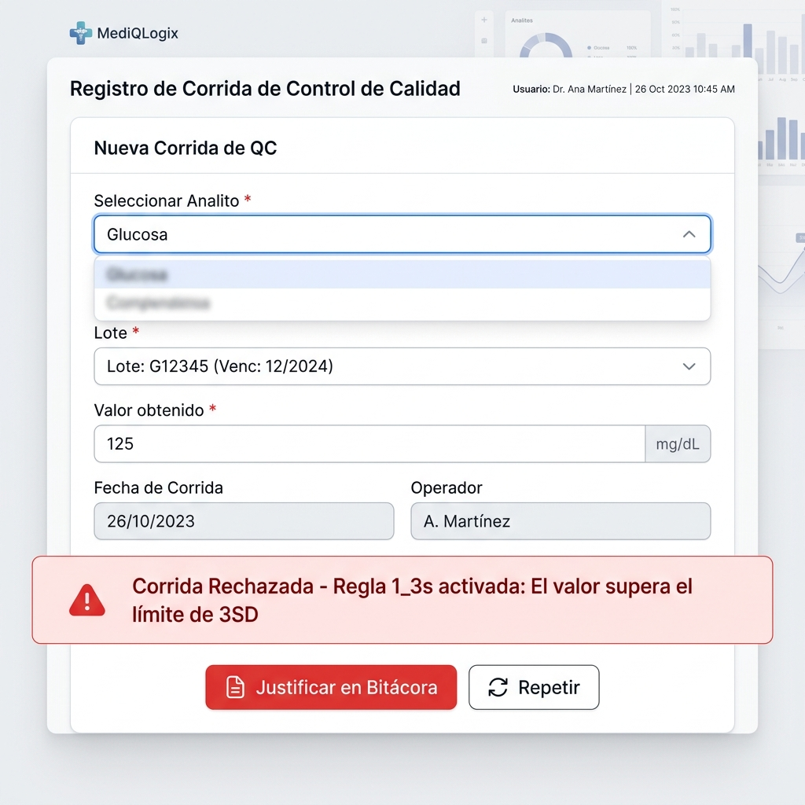
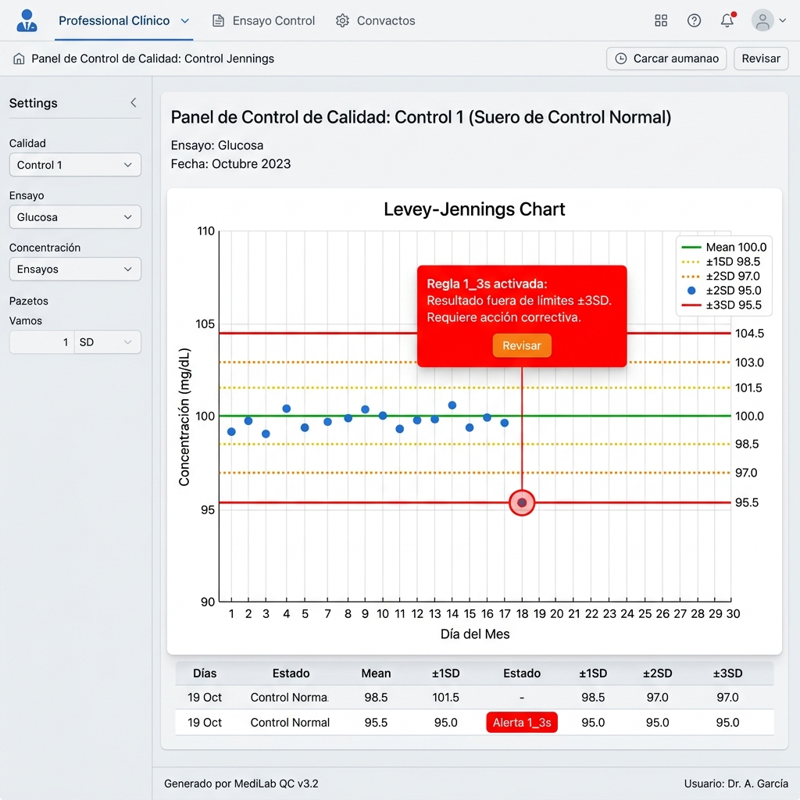

# 🧪 Manual de Usuario e Instrumento Clínico - LabChart QC
### Sistema de Gestión de Control de Calidad Interno Automatizado

Este manual de usuario ha sido estructurado bajo estándares de documentación de software y directrices de control de calidad clínico (**Norma ISO 15189**), ideal para la evaluación de instructores y como guía de referencia rápida para el bacteriólogo u operario en el laboratorio clínico.

---

## 📌 1. Introducción al Sistema
**LabChart QC** es el software encargado del procesamiento estadístico en tiempo real del control de calidad interno. Su objetivo es detectar desviaciones analíticas utilizando las **Reglas de Westgard**. El sistema procesa los datos ingresados por el bacteriólogo, calcula su Z-Score (Desviación con respecto a la media esperada del lote) y determina de manera automática si los resultados de los pacientes pueden ser liberados o si existe una falla en el equipo/reactivo que requiere detener la operación.

---

## 🔐 2. Pantalla de Acceso (Iniciar Sesión)

Para acceder al sistema, el operario debe ingresar al enlace local del servidor del laboratorio.

### Instrucciones de ingreso:
1. Escriba su **Nombre de Usuario** o correo asignado.
2. Escriba su **Contraseña**.
3. Haga clic en **"Iniciar Sesión"**.

> [!IMPORTANT]
> **Pista de Auditoría:** Toda corrida de control registrada o editada en el sistema almacenará la estampa de tiempo y la firma del usuario logueado para fines de trazabilidad e inspección de entes regulatorios.

---

## 📊 3. Panel Principal (Dashboard)

Una vez autenticado, el bacteriólogo accede al Panel Principal, el cual brinda un diagnóstico en tiempo real de la estabilidad del laboratorio.

### Elementos clave de la pantalla:
* **Menú Lateral:** Acceso directo a las funciones del software:
  * **Dashboard:** Estado general actual.
  * **Registrar Control:** Configuración de lotes e insertos.
  * **Registrar Corrida:** Ingreso del resultado del equipo.
  * **Levey-Jennings:** Gráficas de control históricas.
  * **Bitácora de Calidad:** Historial general de resultados de control y alertas.
* **Alertas Activas:** Cuadro dinámico que muestra de forma inmediata qué analito tiene problemas (ej. *Glucosa - Rechazo $1_{3s}$*).
* **Estado Diario:** Resumen gráfico de cuántos controles se pasaron hoy y cuántos están dentro de los rangos seguros.

---

## ⚙️ 4. Registro y Configuración de un Control (Lote/Inserto)

Antes de pasar controles para un analito, el operario o coordinador de calidad debe configurar los parámetros del lote y del reactivo.

### Campos requeridos:
1. **Analito:** Seleccionar la prueba (ej: Glucosa, Creatinina, Colesterol).
2. **Número de Lote (Lot):** Código alfanumérico provisto por el fabricante del control.
3. **Fecha de Vencimiento:** Fecha límite de estabilidad del vial.
4. **Valor Asignado (Media Target $\mu$):** Valor promedio ideal provisto en la hoja de inserto.
5. **Desviación Estándar (SD o DE $\sigma$):** Tolerancia de dispersión del inserto.

---

## 📥 5. Registro de Corridas Diarias y Alertas de Westgard

Es el módulo de trabajo principal del bacteriólogo. Al procesar el vial de control en el equipo automatizado, el resultado obtenido se introduce en este formulario de tres pasos.

### Paso a Paso para el Registro:
1. **Seleccionar Material de Control:** Elige el material en uso (ej. *Multichem S Plus*).
2. **Seleccionar Analito:** Haz clic sobre el analito evaluado (ej. *Glucosa*).
3. **Ingresar Valores por Nivel:**
   * El sistema muestra tarjetas con la **Media** y **Desviación Estándar** configuradas para cada nivel (ej. Nivel 1).
   * Escriba el valor numérico en el campo de texto (ej. `125` mg/dL).
   * **Z-Score en tiempo real:** Debajo del campo, el sistema calcula al instante la desviación. Si el valor supera la tolerancia (Z-Score > 3), se mostrará una franja en color **rojo** para advertir del rechazo inminente antes de guardar.
4. **Notas del Microbiólogo:** Si el control da una alerta amarilla o roja, el operario debe ingresar la **acción correctiva tomada** en el cuadro de texto inferior (ej. *"Se reconstituyó nuevo vial de control y se repitió la lectura"*).
5. Haga clic en **"Guardar Corridas"**.

---

## 📈 6. Gráfico Levey-Jennings

Para monitorear tendencias, identificar sesgos sistemáticos o incrementos en el error aleatorio, el operario debe ingresar a esta sección.

### Interpretación de los Límites en la Gráfica:
* **Línea Central (Verde):** Corresponde a la Media teórica. Los puntos deben fluctuar aleatoriamente arriba y abajo de esta línea.
* **Líneas Amarillas Límite $\pm 1\text{SD}$ y $\pm 2\text{SD}$:** Indican variabilidad normal o zonas de precaución.
* **Líneas Rojas Límite $\pm 3\text{SD}$:** Límite máximo permitido. Cualquier punto fuera de esta línea representa un **Rechazo analítico** inmediato.

---

## 📕 7. Bitácora de Calidad (Historial y Consulta)

La **Bitácora de Calidad** es la base de datos histórica de todas las corridas. Permite a los coordinadores de calidad e inspectores realizar auditorías del desempeño del laboratorio.

### Funcionalidades de la Pantalla:
1. **Filtros Avanzados:** Puedes filtrar los miles de registros del historial usando:
   * Rango de fechas ("Fecha Desde" / "Fecha Hasta").
   * Filtro por **Área** del laboratorio (Hematología, Química, Inmunología).
   * Filtro por **Analito Específico** (ej. *Glucosa*).
2. **Tabla de la Bitácora:** Muestra detalladamente los siguientes campos por cada corrida:
   * **Fecha / Hora:** Registro de tiempo del proceso con hora, minutos y segundos.
   * **Lote / Nivel:** Indica el nivel de control (1, 2, 3), lote del control y el material comercial.
   * **Analito:** La prueba clínica correspondiente.
   * **Resultado:** El valor reportado por la máquina.
   * **Z-Score:** El valor calculado con su distintivo de color.
   * **Estado:** Etiqueta en verde (**ACEPTADO**) o en rojo (**RECHAZADO**).
   * **Observaciones / Acción:**
     * **Observaciones (Letras Rojas + Ícono de Alerta):** El sistema reporta la violación analítica detectada automáticamente (ej. *Violación Regla Westgard 1_3s*).
     * **Acción (Letras Grises + Ícono de Mensaje):** Muestra el comentario/justificación ingresado por el bacteriólogo en el campo de "Notas del Microbiólogo" durante el registro de la corrida (ej. *"Acción: Se calibró el analito..."*).

---

## 🧠 8. Apéndice: Guía Rápida de las Reglas de Westgard Implementadas

| Nombre de la Regla | Tipo de Error | Condición de Activación | Acción Requerida |
| :--- | :--- | :--- | :--- |
| **Regla $1_{3s}$** | Aleatorio | Un solo punto excede los límites de $\pm3\text{SD}$ del valor de media asignado. | **Rechazar corrida.** Detener procesamiento del analito. Buscar errores en el equipo o reactivo. |
| **Regla $2_{2s}$** | Sistemático | Dos corridas consecutivas exceden el límite de $+2\text{SD}$ o el de $-2\text{SD}$ en el mismo sentido. | **Rechazar corrida.** Indicio de desplazamiento sistemático. Calibrar equipo y revisar estabilidad del reactivo. |
| **Regla $R_{4s}$** | Aleatorio | Un resultado de control excede $+2\text{SD}$ y el anterior excede $-2\text{SD}$ (diferencia total de $4\text{SD}$). | **Rechazar corrida.** Error aleatorio de alta dispersión. Revisar estabilidad física del reactivo y del equipo. |
